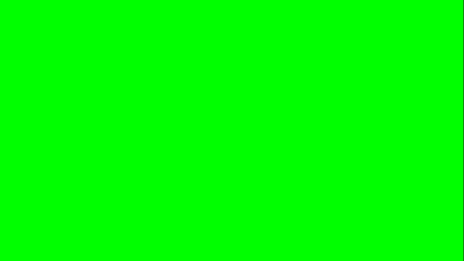
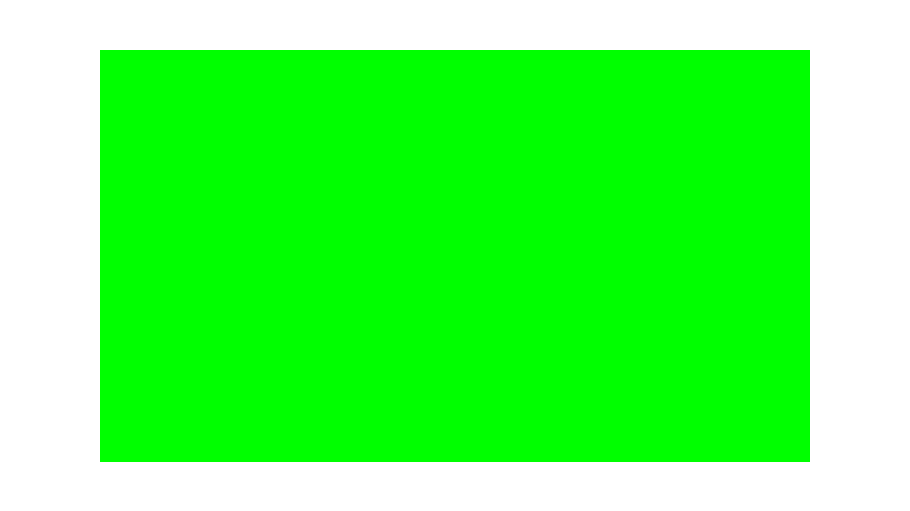
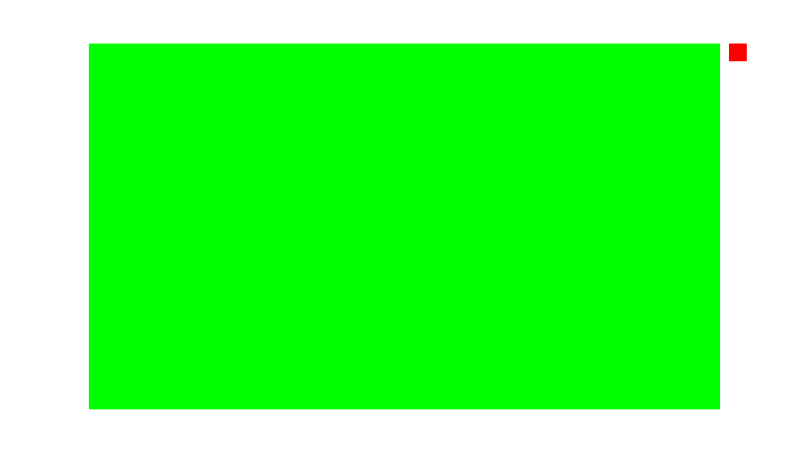

On this page you will learn how to use the package to constrain rectangles
relative to each other. This guide assumes you are familiar
with [Androids Constraint Layout](https://developer.android.com/develop/ui/views/layout/constraint-layout)
but will hopefully also make sense intuitively.

First: the API. Everything you will be interacting with, is located on
the `Constrain` class, which is found in the `Dev.ComradeVanti.RectConstraints`
namespace. To create a constrained rectangle, use the `Rectangle` method, like
this:

```csharp
private void OnGUI()
{
  var rect = Constrain.Rectangle();
  EditorGUI.DrawRect(rect, Color.green);
}
```

The above call will create a `Rect` at (0, 0) with size (0, 0). In order to
create usefull `Rect` objects, we will create constraints and pass them to
the `Rectangle` method. All constraints are optional and can be mixed and
matched as necessary. The different results will be described below.

Let's first create a rect that fills the whole window.

```csharp
var rect = Constrain.Rectangle(
  top: Constrain.toTop.OfWindow,
  right: Constrain.toRight.OfWindow,
  bottom: Constrain.toBottom.OfWindow,
  left: Constrain.toLeft.OfWindow);
```

Notice the usage
of [named arguments](https://docs.microsoft.com/en-us/dotnet/csharp/programming-guide/classes-and-structs/named-and-optional-arguments)
to indicate which constraints should be set at which side.

This results in the created rectangle filling the entire window, in this case,
the game-view:


Next I will add some padding, like this:

```csharp
var rect = Constrain.Rectangle(
  top: Constrain.toTop.OfWindow.WithOffset(50),
  right: Constrain.toRight.OfWindow.WithOffset(100),
  bottom: Constrain.toBottom.OfWindow.WithOffset(50),
  left: Constrain.toLeft.OfWindow.WithOffset(100));
```



As a next step I want to add a little "button" that floats next to the right
edge of the large rectangle. I can do that like this:

```csharp
var button = Constrain.Rectangle(
  top: Constrain.toTop.Of(rect),
  left: Constrain.toRight.Of(rect).WithOffset(10),
  width: Constrain.ToSize(20),
  height: Constrain.ToSize(20));
EditorGUI.DrawRect(button, Color.red);
```



Here I used `left: Constrain.toRight.Of(rect)` to stick the button to the
outside of the left edge of the large rectangle. I also used `Constrain.ToSize`
to specify explicit sizes.

I hope you get the idea from this. In general you can say, that there are two
axies; horizontal and vertical. Each axis, has 3 values you can choose to set;
it's start, end and size. For horizontal these are `left`, `right` and `width`
and for vertical `top`, `bottom` and `height`. You can set all, none or any of
these constraints. The results for a particular axis are listed below.

- Start and size -> Axis starts at the specified position and has specified
  size. Offsets are applied to the right/down
- Start and end -> Axis spans between the two positions
- Size and end -> Axis ends at the specified position and has specified size.
  Offsets are applied to the left/up
- Start, size and end -> Axis has the specified size and is centered between the
  two positions

There are also some combinations that aren't really useful.

- No constraints -> Axis starts and ends at 0
- Only start -> Axis starts and ends at the position
- Only size -> Axis starts at 0 and ends at the specified size
- Only End -> Axis starts and ends at the position

