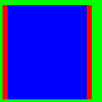

You can pad existing `Rects` using the `Pad` method as well as its "sibling-methods" such as `PadTop` if you are familiar with CSS or Android padding this should all make sense right away. Here is an example:

```csharp
var rect = new Rect(0, 0, 200, 200);
var padded1 = rect.Pad(top: 10, right: 20, left: 5, bottom: 5);
var padded2 = padded1.PadHorizontal(10);

EditorGUI.DrawRect(rect, Color.green);
EditorGUI.DrawRect(padded1, Color.red);
EditorGUI.DrawRect(padded2, Color.blue);
```


